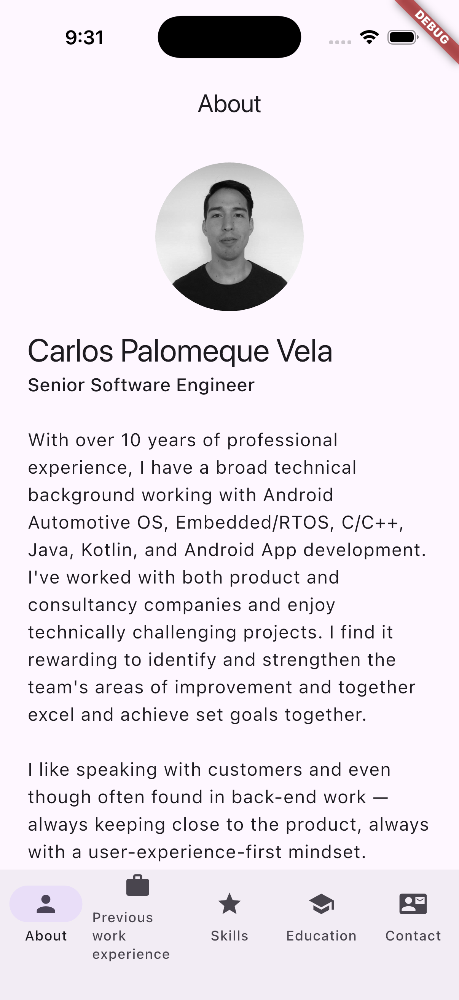

# cv_app

A Flutter CV/portfolio app — bottom-nav shell over 5 static sections (About,
Previous work experience, Skills, Education, Contact). Built as a job-search
showcase project: static Dart data (no backend), `setState`-only state
management, `url_launcher` for tap-to-open contact links.

## Try it

- **Web:** https://cavepv.github.io/flutterCV/
- **Android:** [download the APK](https://github.com/cavepv/flutterCV/releases/tag/v1.0.0)
- **iOS:** see [below](#ios)

## Tech stack

- Flutter/Dart, Material widgets, `url_launcher`
- No state-management package — a single `setState` in `main.dart`'s
  `HomePage` drives all tab switching
- GitHub Actions CI: analyze + test on every push/PR, web deploy to GitHub
  Pages, Android APK attached to `v*` tag releases, iOS build verification

## Develop locally

```bash
flutter pub get
flutter analyze
flutter test
flutter run -d web-server --web-port 8080   # or -d chrome
```

See [`.github/copilot-instructions.md`](../.github/copilot-instructions.md)
for full build/test/lint conventions and known gotchas.

## iOS



The app compiles (`flutter build ios --no-codesign`) and **runs** on iOS
Simulator — verified in CI (`ios-simulator-screenshot` job in
[`cv_app.yml`](../.github/workflows/cv_app.yml), manually triggered via
`workflow_dispatch`).

**Scope/honesty note:** this is Flutter cross-platform development, not
native iOS (Swift/UIKit/SwiftUI) experience. It also hasn't been tested on
physical iOS hardware or distributed via TestFlight/App Store — that
requires a paid Apple Developer account for code signing, which this project
doesn't have.
